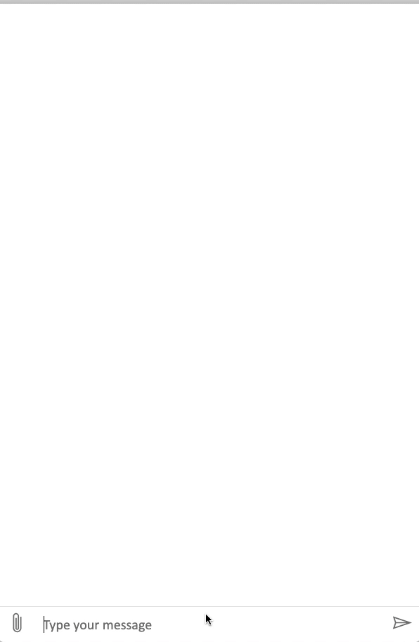

# StockZia
    

## App
The lastest stable version of the app can be tested [here](https://webchat.botframework.com/embed/StockZia_Bot_Channel_Linux/gemini?b=StockZia_Bot_Channel_Linux&s=Yvp7bW7sc7Q.Xu6lkr1z2l6l0GW_gcqTBCievCeTPy0IC3CL3vHxKWE&username=You).

## Run Bot Locally

1. First you will need to download the 
2. Next you will need accounts with the following services (all provide a free teir and student trials)
        - IBM Cloud (IBM Watson)
        - IEX Cloud (Stock Market Api Data)
        - Cloudinary (image hosting)
        - Plotly (chart maker)
        - AlphaVantage (S&P, NASDAQ, DJI data)
3. Gather Api credentials and plug them into the .env_unfilled file
        - Note that for IBM Cloud you have to first make an Watson Assistant Service, and use the Api Keys for that
        - Note that not all the .env fields need to be filled to run locally
        - Note change the `.env_unfilled filename` to `.env`
4. Run node app.js in the root directory of the repo
5. Open the Bot-Framework Emulator, enter `http://localhost:3978/api/messages` as the destination url and press connect.
        -Note that appid and password don't need to be set in the .env and emulator for local deployments 
6. Say 'Hello' and everything should be setup and working locally

## About Repo

* output.js is mostly for making cards, call functions that get data needed
* chart.js makes the graphs, calls the search function to get the data
* app.js is where the program is run and controlled from
* search.js is where the stock market api is called and json is returned

## Resources

Open the [bot card editor](http://adaptivecards.io/visualizer/index.html?hostApp=Facebook%20(Bot%20Framework)) and copy the example json into the editor to make card that can be displayed to the user.

The [Stock market API](https://iextrading.com/developer/docs/#batch-requests) is called via http request, and returns a json

List of [companies](https://api.iextrading.com/1.0/ref-data/symbols)
-remove -B and -b from ticker then split at (the). replace 'e' wit 'a'

Example Stock [Data](https://api.iextrading.com/1.0/stock/aapl/batch?types=company,logo,quote,stats,financials,news,chart,earnings)  
IEX api [docs](https://iextrading.com/developer/docs/#stocks)  

Upload the xml map to https://draw.io

Advantage Index [data](https://www.alphavantage.co/query?function=TIME_SERIES_INTRADAY&symbol=^GSPC&interval=60min&apikey=your_api_key&outputsize=full) and [site](https://www.alphavantage.co/documentation/) and [reference](https://www.alpha-vantage.community/post/world-indexes-9627480?highlight=gspc)  

Market news if from [cnbc](https://newsapi.org/s/cnbc-api)

## Other 
- I will try to keep the progress update logged under the 'project tab'

## Contact
Contact me at claessej@uoguleph.ca if there are any questions or concerns or you have feature ideas